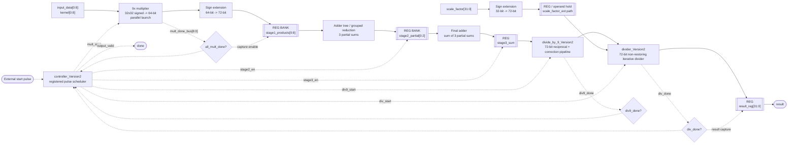
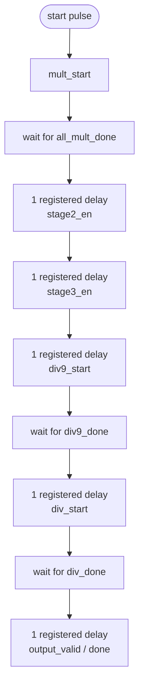
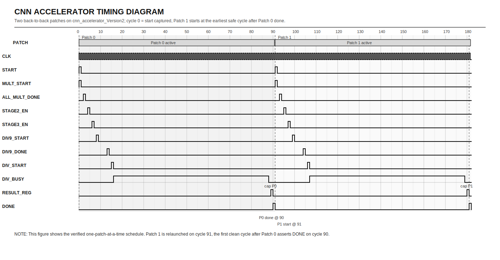
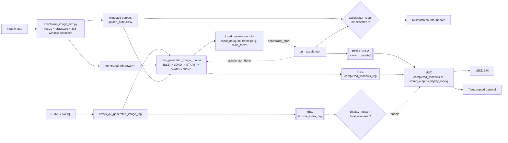
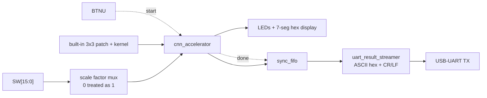

# CNN Architecture Block Diagram

This document describes the current RTL that is actually used by the passing top-level flow in this repository.

Scope:
- Main compute core: `src/cnn_accelerator_Version2.v`
- Main control path: `src/controller_Version2.v`
- Generated-image replay wrapper: `src/cnn_generated_image_runner.v`
- Board wrappers: `board/nexys_a7_top.v` and `board/nexys_a7_generated_image_top.v`

Legend:
- Solid arrows show dataflow.
- Dashed arrows show control or handshake flow.
- `REG` blocks are explicit sequential storage points in the RTL.
- `MUX` blocks represent inferred select logic from `if`/conditional RTL.
- Comparator diamonds represent explicit decision points used for control or correction.

Important implementation note:
- The current top-level accelerator is not built from chained MAC blocks. It uses 9 parallel multipliers followed by staged reduction, then `/9`, then `/K`.
- `src/MAC.v` is present as a verified standalone arithmetic block for the assignment, but it is not the datapath used inside `cnn_accelerator_Version2`.
- `src/cnn_accelerator_multi_div.v` is an alternate throughput-scaling idea in the repo, but the default passing flow and board demos use `cnn_accelerator_Version2`, so that is the architecture shown below.

## 1. Verified Core Datapath And Control (`cnn_accelerator_Version2`)



### Stage-by-stage meaning

| Step | Datapath work | Stored result | Control event |
|---|---|---|---|
| 1 | Launch 9 signed multiplies in parallel | `mult_product[0:8]` -> `stage1_products[0:8]` | `mult_start`, then `all_mult_done` |
| 2 | Add products in 3 groups | `stage2_partial[0:2]` | `stage2_en` |
| 3 | Add the 3 partial sums | `stage3_sum` | `stage3_en` |
| 4 | Exact signed divide by 9 | `div9_result` | `div9_start` -> `div9_done` |
| 5 | Exact signed divide by `scale_factor` | `final_result` | `div_start` -> `div_done` |
| 6 | Truncate final 72-bit quotient to 32-bit output port | `result_reg` | `output_valid` / `done` |

For the current parameters:
- `NUM_INPUTS = 9`
- `PIPELINE_LANES = 3`
- `GROUP_SIZE = 3`
- Multiply fanout is parallel, but patch launches are still controlled one patch at a time in the verified flow.

## 1A. RTL-Style Datapath Detail With Explicit `REG`, `MUX`, And Comparator Blocks

This view makes the hidden hardware decisions more explicit.

```mermaid
flowchart LR
    subgraph FE["Front-end reduction pipeline"]
        p["Patch pixels x0..x8<br/>Kernel h0..h8"] --> pm["9x Parallel Multipliers"]
        pm --> r1[["REG<br/>stage1_products"]]
        r1 --> addg["Adder groups<br/>[0..2] [3..5] [6..8]"]
        addg --> r2[["REG<br/>stage2_partial[0:2]"]]
        r2 --> addf["Final 3-input adder"]
        addf --> r3[["REG<br/>stage3_sum"]]
    end

    subgraph D9["Exact /9 block"]
        r3 --> abs9["Abs + sign extraction"]
        abs9 --> d9r1[["REG S1<br/>abs_dividend_s1<br/>sign_s1<br/>valid_s1"]]
        d9r1 --> recip["Multiply by RECIP_CONST"]
        recip --> d9r2[["REG S2<br/>recip_product_s2<br/>abs_dividend_s2<br/>sign_s2<br/>valid_s2"]]
        d9r2 --> qest["Shift-right quotient estimate"]
        d9r2 --> cmp9a{"q_est*9 > abs_dividend ?"}
        qest --> mux9a["MUX<br/>q_est or q_est-1"]
        cmp9a -. control .-> mux9a
        mux9a --> rem9["Remainder calculation"]
        rem9 --> d9r3[["REG S3<br/>quotient_abs_s3<br/>remainder_s3<br/>sign_s3<br/>valid_s3"]]
        d9r3 --> cmp9b{"remainder >= 9 ?"}
        d9r3 --> mux9b["MUX<br/>+0 / +1 / +2 correction"]
        cmp9b -. control .-> mux9b
        mux9b --> signmux9["MUX<br/>apply sign"]
        signmux9 --> d9r4[["REG S4<br/>quotient_s4<br/>valid_s4"]]
    end

    subgraph DK["Final /K divider"]
        d9r4 --> divshift[["REG<br/>dividend_shift_reg"]]
        k["scale_factor"] --> signextk["Sign extension"]
        signextk --> divkreg[["REG<br/>divisor_abs_reg"]]
        divshift --> sh["Shift remainder and next dividend bit"]
        divkreg --> addsubmux["MUX<br/>+divisor or -divisor"]
        remreg[["REG<br/>remainder_reg"]] --> sh
        remreg --> cmpd{"remainder sign ?"}
        sh --> addsub["Adder/Subtractor"]
        addsubmux --> addsub
        cmpd -. control .-> addsubmux
        addsub --> remnext[["REG writeback<br/>remainder_next"]]
        remnext --> remreg
        addsub --> qbit["Quotient-bit generation<br/>~remainder_next[MSB]"]
        qbit --> qreg[["REG<br/>quotient_abs_reg"]]
        countreg[["REG<br/>count_reg"]] --> cmpdone{"count == 1 ?"}
        cmpdone -. done/control .-> outreg[["REG<br/>result_reg"]]
        outreg --> finalqd([Quotient / done])
    end
```



Reading tip:
- The front-end is mostly regular pipeline storage plus adder reduction.
- The `/9` block uses comparator-driven correction MUXes.
- The final divider uses a sign comparator plus an add/sub MUX every iteration, then stores the next remainder and quotient bit in registers.

## 2. Control Schedule Used By `controller_Version2`

The controller is not a complex FSM with busy/ready handshakes. It is a registered pulse chain that advances the same patch through each stage.



Design implication:
- This is an intra-patch staged datapath, not a fully back-pressured streaming pipeline.
- The safe operating model in the verified flow is: launch one patch, wait for `done`, then launch the next patch.
- That is exactly how `tb/cnn_accelerator_tb_Version2.v` and `src/cnn_generated_image_runner.v` use the accelerator.

Latency note:
- The dominant stage is the final 72-bit divider.
- In practice, the current RTL behaves much closer to a roughly 90-cycle single-patch path than to a short fully overlapped streaming pipeline.

## 2A. Long Timing Diagram For The Most Important Path (>40 Cycles)

The most important timing path in the current design is the single-patch top-level accelerator schedule, because it includes the latency-dominant 72-bit final divider.

For a cleaner report-style figure, this datasheet-like timing diagram shows two back-to-back patches:



How to read the second patch:
- Patch 0 asserts top-level `DONE` on cycle `90`.
- Patch 1 is shown starting on cycle `91`, which is the earliest clean back-to-back relaunch point in the verified one-patch-at-a-time schedule.
- Its control pulses repeat with the same offsets, so Patch 1 reaches `DONE` on cycle `181`.

Reference point:
- Cycle `0` is the rising clock edge where `controller_Version2` captures a clean `start` pulse.
- `^` = single-cycle pulse/event.
- `=` = block busy/active for multiple cycles.

```text
Cycle idx        : 00   05   10   15   20   25   30   35   40   45   50   55   60   65   70   75   80   85
Marker           : |....|....|....|....|....|....|....|....|....|....|....|....|....|....|....|....|....|....|
start(captured)  : ^------------------------------------------------------------------------------------------
mult_start       : ^------------------------------------------------------------------------------------------
mult_launch      : -^-----------------------------------------------------------------------------------------
all_mult_done    : --^----------------------------------------------------------------------------------------
stage1_cap       : ---^---------------------------------------------------------------------------------------
stage2_en        : ----^--------------------------------------------------------------------------------------
stage2_cap       : -----^-------------------------------------------------------------------------------------
stage3_en        : ------^------------------------------------------------------------------------------------
stage3_cap       : -------^-----------------------------------------------------------------------------------
div9_start       : --------^----------------------------------------------------------------------------------
div9_busy        : ---------====------------------------------------------------------------------------------
div9_done        : -------------^-----------------------------------------------------------------------------
div_start        : ---------------^---------------------------------------------------------------------------
div_busy         : ----------------========================================================================---
div_done         : ----------------------------------------------------------------------------------------^--
result_cap       : -----------------------------------------------------------------------------------------^-
done             : ------------------------------------------------------------------------------------------^
```

The compact axis labels stop at `85`, but the final pulse shown at the far right is cycle `90`.

### Key cycle events

| Cycle | What happens |
|---|---|
| 0 | `start` is captured by `controller`; `mult_start` is asserted for one control cycle |
| 1 | 9 parallel multipliers actually launch |
| 2 | `all_mult_done` goes high |
| 3 | `stage1_products[]` registers capture all 9 sign-extended products |
| 4 | `stage2_en` pulse |
| 5 | `stage2_partial[]` registers capture the 3 grouped sums |
| 6 | `stage3_en` pulse |
| 7 | `stage3_sum` register captures the final accumulated 72-bit sum |
| 8 | `div9_start` pulse |
| 9 to 12 | `divide_by_9_Version2` pipeline is active |
| 13 | `div9_done` pulse |
| 15 | `div_start` pulse to the final 72-bit divider |
| 16 to 87 | `divider_Version2` iterative loop is busy for 72 cycles |
| 88 | `div_done` pulse |
| 89 | `result_reg` captures the final quotient |
| 90 | top-level `done` / `output_valid` pulse |

### Why This Diagram Is Longer Than 40 Cycles

The front-end multiply/reduction path is short. The schedule becomes long because:
- `divide_by_9_Version2` adds 4 pipeline cycles
- `divider_Version2` runs for `WIDTH = 72` cycles in the top-level instance
- the registered controller inserts additional cycle boundaries between major stages

So the effective single-patch latency is about 90 cycles from captured `start` to asserted `done`.

### Divider-Focused Timing Summary

Since the final divider is the latency bottleneck, its local timing is:

| Divider-local cycle | Event |
|---|---|
| 0 | `start` sampled, operands loaded, `busy` asserted, `count_reg = 72` |
| 1 to 71 | iterative non-restoring update of `remainder_reg`, `quotient_abs_reg`, `dividend_shift_reg`, and `count_reg` |
| 72 | final quotient/remainder written, `done = 1`, `busy = 0` |

## 3. Generated-Image Replay And Board Flow

This is the higher-level system used when the repo replays a real image that has been preprocessed into 3x3 windows.



Runtime behavior:
- `scripts/run_image_sim.py` creates `generated_windows.vh` plus software-side golden outputs.
- `cnn_generated_image_runner` loads one patch at a time into `cnn_accelerator`.
- When `accelerator_done` arrives, the runner stores the 16-bit displayed result, checks it against the expected value, and either loads the next window or asserts `done`.
- `board/nexys_a7_generated_image_top.v` lets BTN U either start a full replay or browse stored results, depending on `SW[0]`.

## 4. Board Demo Output Path (`nexys_a7_top`)

The simpler board demo path uses a built-in patch and kernel, then queues completed results for UART transmission.



That path is useful for the board demo because:
- the display shows the most recent result immediately
- the FIFO decouples accelerator completion from UART byte-by-byte transmit latency

## 5. Performance And Utilization

For whole-project metrics, the most representative implemented top in this repo is:
- `nexys_a7_generated_image_top`

Why this top was chosen:
- it includes the accelerator
- it includes the generated-image runner/control logic
- it includes on-chip result storage and board display logic
- it is a true routed top-level build, unlike the tiny `USE_GENERATED_RESULT_ROM` playback build in `vivado/create_project.tcl`

Reports used:
- `vivado_build/cnn_generated_image_sim/cnn_generated_image_sim.runs/impl_1/nexys_a7_generated_image_top_timing_summary_routed.rpt`
- `vivado_build/cnn_generated_image_sim/cnn_generated_image_sim.runs/impl_1/nexys_a7_generated_image_top_utilization_placed.rpt`

Assumptions used for the performance table:
- Latency is measured per generated 3x3 window, not per entire image.
- The runner adds a small amount of sequencing overhead around the accelerator, so the effective window latency is about `94` cycles.
- The implemented routed design does **not** meet `100 MHz`; reported `WNS = -4.475 ns` gives an approximate `Fmax = 69.1 MHz`.

### 5.1 Performance Metrics

| Metric | Value |
|---|---|
| Latency | `~94 cycles` per generated window, which is `~1.361 us` at approximate `69.1 MHz` |
| Throughput | `~1 window / 94 cycles` = `~0.735 Mwindow/s` at approximate `69.1 MHz` |
| Frequency | `100 MHz` target is **not met**; routed `WNS = -4.475 ns`, approximate `Fmax = 69.1 MHz` |

Optional derived values:
- If the same design were forced to `100 MHz`, the same `~94`-cycle latency would be `~0.94 us`, but the current routed timing report shows that clock target is not met.
- At `100 MHz`, the nominal initiation rate would be `~1.064 Mwindow/s`, again assuming timing were closed.

### 5.2 Resource Utilization

| Resource | Usage |
|---|---|
| LUT | `2376` |
| FF | `2741` |
| BRAM | `4.5 Block RAM Tiles` (`9 x RAMB18`) |
| DSP | `53` |

Utilization context on `xc7a100tcsg324-1`:
- LUT utilization: `3.75%`
- FF utilization: `2.16%`
- BRAM utilization: `3.33%`
- DSP utilization: `22.08%`

### 5.3 Functional Metrics

These functional metrics are based on the current verification artifacts in the repo:
- `generated_data/output_comparison.csv`
- `tb/data/cnn_complex_vectors.csv`
- a fresh `sim.bat cnn_csv` regression run on `2026-04-23`

| Metric | Value |
|---|---|
| Accuracy | `100.00%` on the latest generated-image dataset: `676/676` output samples matched the golden reference |
| Error rate | `0 / 676` mismatches on `generated_data/output_comparison.csv` |
| Output quality | Bit-exact to the golden feature map on the verified dataset: `MAE = 0`, `RMSE = 0`, `Max abs error = 0` |
| Instruction Supported | Not an instruction-set processor; this is a fixed-function accelerator that supports one signed 3x3 window operation per `start`: `result = trunc_toward_zero(trunc_toward_zero(sum(xi*hi)/9)/scale_factor)` |
| Pipeline Correctness | `Yes` for the verified staged single-patch schedule; it is functionally correct in the tested flow, but it is **not** a fully overlapped inter-patch streaming pipeline |

Extra verification note:
- The current CSV regression also passed `8/8` cases with `100.00%` accuracy and zero observed arithmetic error.

### 5.4 Core-Only Reference

If you also want the compute core without the board/image wrapper, the earlier core-only `cnn_accelerator` synthesis report gives:
- LUT: `4433`
- FF: `3532`
- BRAM: `0`
- DSP: `0`
- `100 MHz` met with `WNS = +3.472 ns`

That core-only reference is useful for arithmetic-block discussion, but the whole-project tables above are the better fit for a full-system report.

### 5.5 Bottlenecks

- Timing bottleneck: In the routed whole-project top (`nexys_a7_generated_image_top`), the worst setup path is inside `generated_runner_inst/dut/div9_inst`, so the current `divide_by_9_Version2` implementation is the main frequency limiter at the system level.
- Latency bottleneck: The final `divider_Version2` stage uses a `WIDTH = 72` iterative signed divider, so it contributes about `72` cycles by itself and dominates end-to-end window latency.
- Throughput bottleneck: The verified control flow is one-window-at-a-time. The next patch is not launched until the current patch finishes, so the initiation interval is close to the full latency.
- System bottleneck: `cnn_generated_image_runner` uses `LOAD -> START -> WAIT -> DONE` sequencing for every window, which is simple and correct but prevents inter-window streaming overlap.
- Timing-closure bottleneck: The whole-project routed build misses `100 MHz` with `WNS = -4.475 ns`, so practical system throughput is limited by timing closure, not just by algorithmic cycle count.

### 5.6 Performance Insights

- The multiply/reduction front-end is relatively fast: 9 products are launched in parallel and reduced in a few stages, so convolution itself is not the dominant cost.
- The normalization backend is the expensive part: `/9` limits clock frequency, while the final `/scale_factor` divider limits latency.
- There is a clear mismatch between computation style and control style: the datapath has internal staging, but the external schedule is still serialized per patch.
- Resource usage shows where performance is being spent: the whole-project build uses `53 DSPs` and `9 RAMB18` blocks, which is consistent with a parallel arithmetic front-end plus stored generated-image data/results.
- If performance is the goal, the best payoff would come from optimizing or further pipelining `divide_by_9_Version2`, reducing or parallelizing the final divider, or adopting the repo's alternate multi-divider direction in `src/cnn_accelerator_multi_div.v`.
- If timing closure at `100 MHz` is the goal, the first place to focus is the `div9_inst` critical path reported by Vivado, not the display or UART logic.

## 6. Short Summary

If you need one sentence for the project report, this repo currently implements:

> A 3-stage reduction datapath around 9 parallel signed multipliers, followed by a 4-stage divide-by-9 block and a wide iterative final divider, all sequenced by a pulse-based controller and wrapped by board/image replay logic.

